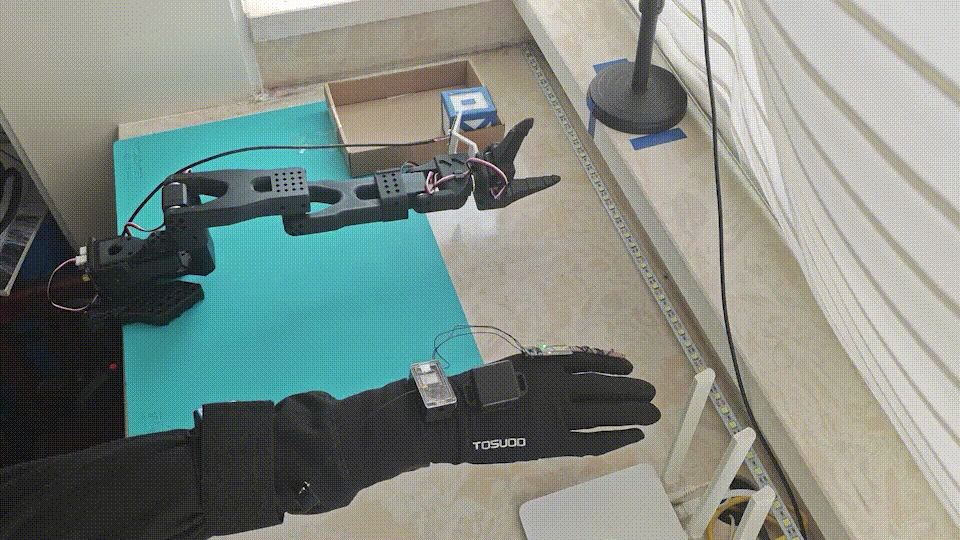
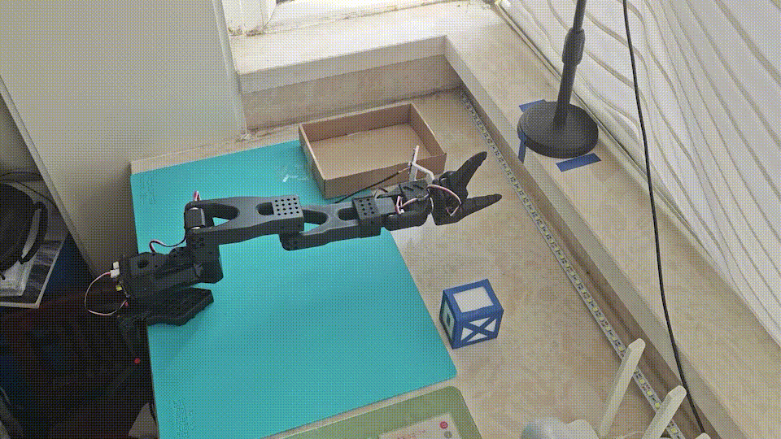
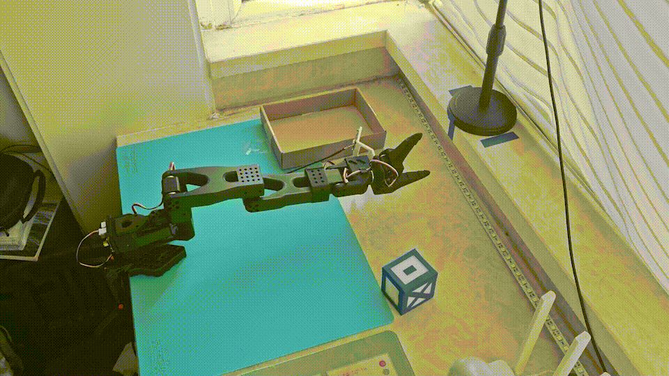

# lerobot_teleoperator_fleximu



Teleoperator plugin for LeRobot that maps 3 IMUs + 1 flex sensor signals to SO-101 6-DoF joint actions.
This package also provides preflight wrappers to reduce dangerous startup jumps after IMU/FLEX calibration.

- `fleximu-preflight`: run preflight only
- `fleximu-safe-teleoperate`: run preflight to a fully extended pose , then launch the official `lerobot-teleoperate`
- `fleximu-safe-record`: run preflight to a fully extended pose, then launch the official `lerobot-record`

## Install

```bash
pip install -e .
```

## Usage

#### Preflight Only

```bash
fleximu-preflight \
  --robot.type=so101_follower \
  --robot.port=[your_port] \
  --robot.disable_torque_on_disconnect=false \
  --teleop.type=fleximu_teleop \
  --teleop.id=fleximu_controller \
  --mujoco_model_path=path/to/robot_scene.xml \
  --display_data=true \
```

#### Safe Teleoperate

```bash
fleximu-safe-teleoperate \
  --robot.type=so101_follower \
  --robot.port=[your_port] \
  --robot.disable_torque_on_disconnect=false \
  --teleop.type=fleximu_teleop \
  --teleop.id=fleximu_controller \
  --mujoco_model_path=path/to/robot_scene.xml \
  --display_data=true \
```

#### Safe Record

```bash
fleximu-safe-record \
  --robot.type=so101_follower \
  --robot.port=[your_port] \
  --robot.disable_torque_on_disconnect=false \
  --teleop.type=fleximu_teleop \
  --teleop.id=fleximu_controller \
  --dataset.repo_id=<user>/<dataset_name> \
  --dataset.num_episodes=10 \
  --dataset.single_task="my task" \
  --display_data=true \
```

## Flags
#### Preflight Flags

- `--preflight.enabled=true|false` (default `true`)
- `--preflight.mode=rrt|linear` (unsupported values fallback to linear)
- `--preflight.duration_s=3.0`
- `--preflight.hz=30`
- `--preflight.hold_s=0.3`
- `--preflight.require_enter=true|false` (default `false`)
- `--preflight.keep_torque_on_disconnect=true|false` (default `true`)
- `--preflight.tolerance=2.0`
- `--preflight.strict=true|false` (default `false`)
- `--preflight.rrt_max_iter=2000`
- `--preflight.rrt_step_size=0.1`
- `--preflight.rrt_interp_step=0.08`
- `--mujoco_model_path=...` (required for `rrt`)

#### Teleop Safety Flags

These are plugin teleop parameters. Pass them with `--teleop.<name>=...`.

**Virtual wall Related:** (enforces a minimum end-effector z height).

- `--teleop.enable_virtual_wall=true|false` (default `true`)
- `--teleop.virtual_wall_clearance=0.06` (meter)

**Ground safety filter (GSF) Related:** (automatically raises the end-effector z so the closest tracked geom stays at least `d_safe` above the ground).

- `--teleop.enable_gsf=true|false` (default `true`)
- `--teleop.model_xml=...` (MuJoCo model xml path, which is required for floor collision detection)
- `--teleop.tracked_geom_root_body=wrist` (set empty string to disable root-body filter)
- `--teleop.floor_geom_name=floor`
- `--teleop.d_safe=0.04`
- `--teleop.d_on=0.06`
- `--teleop.d_off=0.07`
- `--teleop.h_max=0.20`
- `--teleop.bisection_iters=18`
- `--teleop.distmax=1.0`
- `--teleop.alpha=0.70`
- `--teleop.track_only_collision_geoms=true|false`
- `--teleop.ik_q123_scale=-1.0`

## BOM

Hardware BOM is available in [hardware/BOM.md](hardware/BOM.md).

## Notes
- `fleximu-safe-teleoperate` is a wrapper around `lerobot-teleoperate` and `fleximu-safe-record` is a wrapper around `lerobot-record`.
- All unknown arguments are forwarded to the official command as-is.
- Wrapper-only arguments are consumed by wrapper:
  - `--preflight.*`
  - `--mujoco_model_path`
- The wrapper also auto-injects:
  - `--teleop.discover_packages_path=lerobot_teleoperator_fleximu`
  - `--teleop.model_xml=<mujoco_model_path>` (unless you already set `--teleop.model_xml`)
- In preflight, `linear`: smooth interpolation in action space, `rrt`: runs RRT-connect in joint space, then executes densified trajectory (highly recommended).
- In `fleximu-safe-teleoperate` / `fleximu-safe-record`, `mujoco_model_path` is forwarded to `--teleop.model_xml` unless you set `--teleop.model_xml` explicitly.
- `rrt` mode in preflight and `Ground Safety Filter` requires `mujoco` and a valid model XML/MJCF path.

## Demo 
Results of Data Collection and Training with the Teleoperator Fleximu

**ACT**



**SmolVLA** (task: "Pick up the marked white block and place it into the cardboard box")




